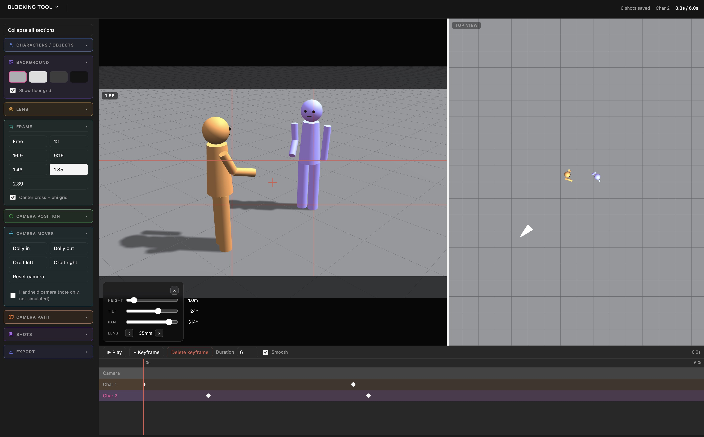

# Blocking Tool

A 100% free, single-file 3D previs / shot-blocking web app — created for the love of stories by [Arno Faure](https://arnofaure.com).

🔗 **[blocking.arnofaure.com](https://blocking.arnofaure.com)** · 📝 [Changelog](CHANGELOG.md)

## Features

- Place characters and simple props (car, bus, wall, house, table, chair) in a 3D scene, in both a main perspective view and a top-down view
- Drag to move, rotate, and scale objects; stand/sit/lie pose presets plus per-joint posing (shoulders, elbows, hips, knees, head)
- Real-world size readout for props in meters, feet & inches, or inches
- Double-click any name in the list to rename it
- Lock any character/object in place (`L`) so it can't be dragged by accident
- Group two or more items to move and keyframe them together
- Full camera control — height, tilt, pan, focal length (14mm–200mm lens presets), aspect-ratio crop guides, phi (golden ratio) composition grid
- On-screen camera HUD overlaid on the main view for height/tilt/pan/lens, in addition to the side panel controls
- Draw a camera path by holding Shift and dragging on the floor (in either view), with adjustable height and an option to have the camera follow it over the timeline
- Multi-track keyframe timeline per character/object/camera, with draggable keyframes to retime them, smooth spline or per-segment easing
- Save/export/import shots as JSON to back up or share a shot list
- Record the timeline playback straight to a WebM video
- Undo (Cmd/Ctrl+Z)
- Runs entirely in your browser — no account, no upload, no tracking

## Usage

Just open `index.html` in a browser, or visit [blocking.arnofaure.com](https://blocking.arnofaure.com).

## How to use it

1. **Everything stays on your device.** The tool runs entirely in your browser — nothing is uploaded, no account needed.
2. **Add characters and objects** from the left panel, then drag them in either the main view or the top view to place them. Drag empty space to orbit the camera; drag the white marker in the top view to move the camera itself.
3. **Camera.** Use the Camera position sliders (or the on-screen HUD in the main view) for height/tilt/pan, and the Lens presets for focal length. Draw a camera path by holding Shift while dragging on the floor.
4. **Keyframes.** Select a character, object, camera, or group, move the playhead, then "+ Keyframe". Drag keyframe marks on the timeline to retime them.
5. **Group.** Check two or more items in the list (or Ctrl/Cmd-click them) and hit "Group selected" to move and keyframe them together.
6. **Save your work** with "+ Save shot", export the shot list as a file to back it up, and use Record to export a video of the timeline.

The same info is available anytime in the app via **Menu → Help**.

## Contact

Bug, idea, or feature request? — [info@arnofaure.com](mailto:info@arnofaure.com)

## License

Code is open source. Content/branding is licensed under [CC BY-NC 4.0](https://creativecommons.org/licenses/by-nc/4.0/).
